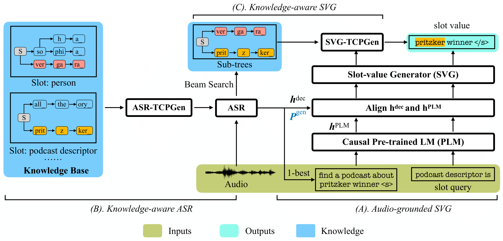

# The example directory for the KA2G framework #

<!-- PIPELINE -->
 

  
  <h3 align="center">The KA2G Framework for Knowledge-Aware Audio-Grounded Generative Slot Filling</h3>
  

## Feature extraction ##
Feature extraction and label .json file preparation follows `espnet/egs2/slurp/asr1`. Please check the README.md file there.
Once features are extracted, `data_unigram600suffix.json` file should be in `dump/{train,devel,test}/deltafalse/` directory. Biasing entities and slot labels should be added for each utterance. 

Two example utterances having those labels can be found in `dump/train/deltafalse/data_unigram600suffix_KBf30onto_slufull.json` which is the label file used in the paper.

## Training ##
Use the train.sh to train the model. In the paper, ASR is pretrained on Librispeech 960h data, and the model parameters are used to initialise the ASR part in KA2G. Also there is an option to fine-tune the PLM on SLURP training data first, and use the fine-tuned model parameters to initialise the PLM in KA2G.

Versions used in the paper:\
`PyTorch 1.12.0` \
`Transformers 4.20.1`

Relevant files:

`espnet/espnet/nets/pytorch_backend/e2e_asr.py`: main model definition file \
`espnet/espnet/nets/pytorch_backend/KB_utils/KB.py`: Biasing list extraction and organising into prefix-trees \
`espnet/espnet/nets/pytorch_backend/KB_utils/SLU.py`: Audio-grounded SVG and SVG-TCPGen \
`espnet/espnet/nets/pytorch_backend/modality/plm.py`: PLM definition and word-boundary alignment \
`espnet/espnet/nets/pytorch_backend/rnn/decoder.py`: Attention-based encoder decoder model with TCPGen 

## Inference ##
An example array job submission file using slurm is `slurm_submit_cpu_cclake` which executes `decode_bpe.sh`.
